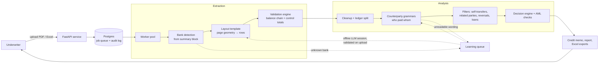

# Loan Underwriting Automation Tool

**Bank statement in, verified figures and a credit decision out.**

A tool for small-business lending in Nigeria. It reads merchant bank statements (PDF or Excel),
extracts every transaction, *proves* the extraction correct against the totals the bank itself
printed, and turns the verified ledger into an underwriting decision with the evidence attached.

> This repository is a **project showcase**: architecture, design decisions and results. The
> production source code and the statement corpus are not published, because the corpus is
> real borrower data. The [example](examples/reconcile.py) is a small standalone illustration
> of the core idea, written for this page.

---

## The problem

Underwriters were reading bank statements by hand: hundreds of pages per applicant, a dozen
banks with a dozen layouts, and decisions resting on totals typed into a spreadsheet. It was slow,
inconsistent, and nobody could say how accurate the numbers were.

Off-the-shelf options did not fit:

- **Generic table extractors fail on these documents.** One bank's statement fragments into
  single-row tables, another collapses 17 rows into one cell, a third yields zero tables.
- **LLM extraction cannot be trusted with money.** A model that misreads one digit in 29,000
  rows gives a confident, wrong answer, and you cannot tell which answer it was.

## The approach

**No language model in the extraction or scoring path.** Statements are parsed deterministically
from page geometry with one small JSON template per bank layout, and every result is checked by
arithmetic:

```
balance[n]  ==  balance[n-1] + credit − debit − charge          (every row)
opening + Σcredits − Σdebits  ==  closing                       (whole statement)
```

Drop a row, shift a number into the wrong column, or misread a digit, and at least one identity
breaks. So accuracy is not sampled or estimated: it is **proved**, in exact decimal arithmetic,
against figures the bank printed. Each output file carries a `validation` block listing every
check, what was expected, what was found and the difference.

| Status | Meaning |
|---|---|
| `passed` | Every extracted figure reconciles exactly. |
| `review_required` | Arithmetically sound, but there was nothing printed to verify against, or a human needs to look. |
| `failed` | Does not reconcile. Reported with the exact delta, never smoothed over. |

An LLM is used only **offline, to teach the engine**: drafting a layout template for a bank it has
never seen, or a pattern for a transaction wording it cannot read. Everything it produces is
validated by the engine before it is stored. Once taught, that bank or wording parses at zero
marginal cost for every future applicant.

## Results

| Measure | Result |
|---|---|
| Sample corpus | 30 files, 9,814 PDF pages, processed in 63 s |
| Fully reconciled | 24 of 30 files; the other 6 are flagged with exact deltas, not hidden |
| Largest statement | 2,647 pages → 29,103 transactions, fully reconciled, in 11 s |
| Throughput | ~324 pages / second / CPU core, no per-page or per-token cost |
| Banks / layouts covered | 15+ Nigerian banks and fintech wallets, 25+ layout templates |
| Accuracy gate in CI | Mean reconciliation ≥ 99.5% with no per-file regressions |

## Architecture



More detail: [docs/architecture.md](docs/architecture.md).

## Key features

**Extraction**
- Bank identity is detected from the statement's own summary block, never from transaction rows
  (other banks' names appear in narrations all the time).
- Per-bank templates over word coordinates, page-relative so variable page widths still work.
- Statements that contain two accounts (e.g. a wallet and a savings pocket) are split into separate
  ledgers. Merging them would nearly double apparent turnover.
- Excel exports that round money through floats are quantised back to the kobo on read.
- Scanned documents are detected and routed to review rather than guessed at.

**Analysis and decision**
- Counterparty extraction with ordered regex grammars, so the engine knows *who* each payment came
  from: needed for concentration, related-party and self-transfer checks.
- Three distinct outcomes for a wording: a named party, `no_party` (fees, VAT), or `unidentified`.
  Unreadable money is shown as unreadable, never quietly treated as "no counterparty".
- Self-transfers, reversals, loan disbursements and repayments are filtered out of "sales" before
  scoring, each with the rows that triggered it.
- AML-style checks and a decision engine that produces a recommendation with evidence.

**Human review, fully audited**
- Statement sign-off (accept / reject with reason), row-level confirm / remove on any finding, and
  application settings for inputs the engine cannot derive.
- A "how sure we are" score per finding, from the share of money resting on unread names.
- Every human decision is stored with who, when and why in an append-only log.

**Learning loop**
- Unknown layouts and unreadable wordings go to a queue, exported as a zip or workbook, worked in an
  LLM session, and uploaded back. Uploads are all-or-nothing: every pattern must compile, be safe,
  and read its own examples through the real engine.
- A background sweep pre-fills suggested patterns for the most material wordings.

**Engineering**
- Stateless containers on a read-only filesystem (only `/tmp` writable); state in Postgres and S3.
- Numbered, immutable database migrations; multi-replica safe.
- Role-based access (user / superuser / admin) with SSO sign-in.
- CI: unit, integration and end-to-end tests, the accuracy harness, dependency audit, a read-only
  container check that fails on any write outside `/tmp` or any secret in the logs, and image
  scanning.

## Tech stack

Python · FastAPI · PyMuPDF · openpyxl · PostgreSQL · S3 · Docker · Kubernetes · GitHub Actions ·
pytest · vanilla JavaScript single-page UI

## What I learned

Some findings that shaped the design are in [docs/design-decisions.md](docs/design-decisions.md).
The short version:

1. **Make correctness checkable, not probable.** Documents with built-in redundancy (running
   balances, printed totals) let you prove an extraction instead of estimating it.
2. **Fail loudly and specifically.** A file that does not reconcile says so, with the exact delta.
   Underwriters trust a tool that admits what it does not know.
3. **Use AI where mistakes are caught.** The LLM writes templates and patterns that are validated
   before use; it never touches a figure that reaches a credit decision.

## My role

I designed and built the tool end to end: extraction engine, validation, analysis and decision
logic, review workflow, UI, test and accuracy harness, CI, and the container and deployment setup.

## Try the core idea

```bash
python examples/reconcile.py
```

A ~100-line, dependency-free illustration of balance-chain and control-total reconciliation, with a
deliberately corrupted row to show how a misread is caught.
