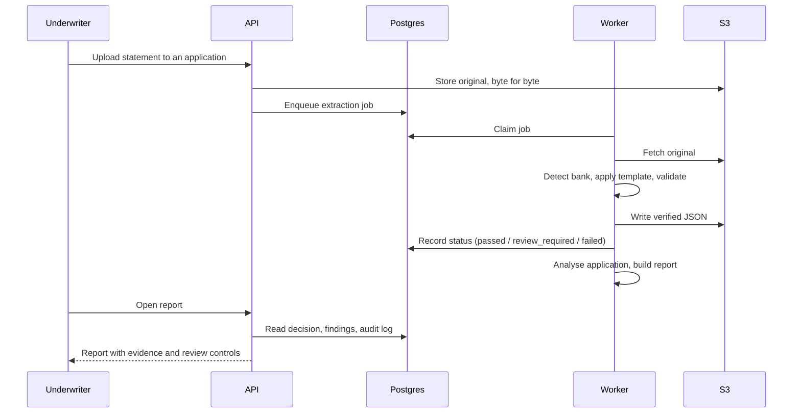
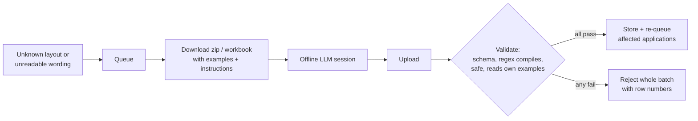

# Architecture

## Components

| Layer | Responsibility |
|---|---|
| **Extraction** | Statement in, verified JSON out. Bank detection, layout templates over page geometry, PDF and Excel parsers, the validation engine. |
| **Analysis** | Verified JSON in, scored decision out. Cleanup, ledger split, counterparty grammars, the filter matrix, the decision engine, AML checks, the learning queue. |
| **Results** | Credit memo, printable report, Excel exports. |
| **Service** | FastAPI for all HTTP, a Postgres store and job queue, an in-pod worker pool, storage mirrored to S3, authentication and roles. |
| **UI** | A single-page vanilla JavaScript app built into one file. |

## Request flow



## Data model on disk

One application is one folder. Originals are never modified, and each JSON output takes its
source file's name, so the mapping is obvious.

```
applications/<APPLICATION_ID>/
    input/         <statement>.pdf
    output/        <statement>.json      verified transactions + validation block
    analysis/      stored reports (JSON + HTML)
    manifest.json  every document, its bank, status and totals
```

In a cluster there is no persistent disk. Every file is published as it is written (small ones
inline in Postgres, large ones to S3), and local disk is only a working copy. File times come from
Postgres, so "is this report out of date?" gives the same answer on every replica.

## Validation engine

Each template declares which checks its bank supports. Typical checks:

- **Balance chain**: every row's balance equals the previous balance plus credit minus debit
  minus charges.
- **Control totals**: printed total credits, total debits and transaction count match the
  extracted rows.
- **Opening to closing**: opening balance plus credits minus debits equals the closing balance.

All arithmetic is `Decimal`. A file is `passed` only if a real verifier applied. A statement that
prints neither totals nor running balances is `review_required`, because parsing cleanly is not
the same as being verified.

## Learning queue



Nothing in the queue changes a credit figure by itself. Only a stored template or grammar does,
and storing one re-analyses every affected application.

## Reliability and security

- Read-only root filesystem; only `/tmp` is writable. Settings come only from environment
  variables, and start-up lists any missing setting by name and refuses to run.
- No blocking database or storage calls on the event loop.
- Structured JSON logs with a scrubber: never secrets, tokens, cookies or statement content.
- SSO sign-in with roles from directory groups; signed session cookies shared across replicas.
- Append-only audit log for every human decision.
